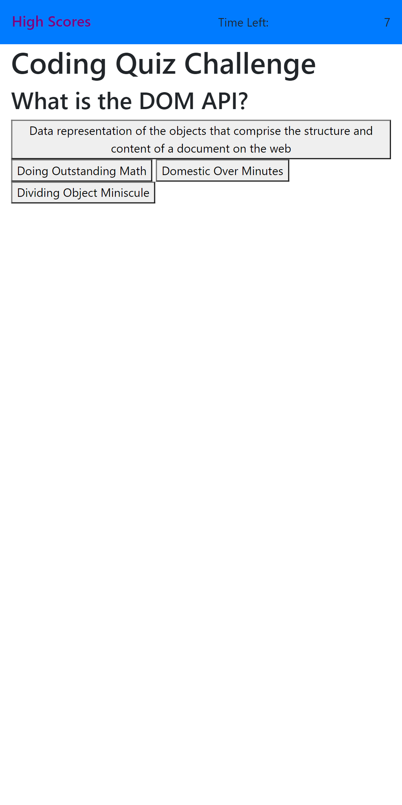
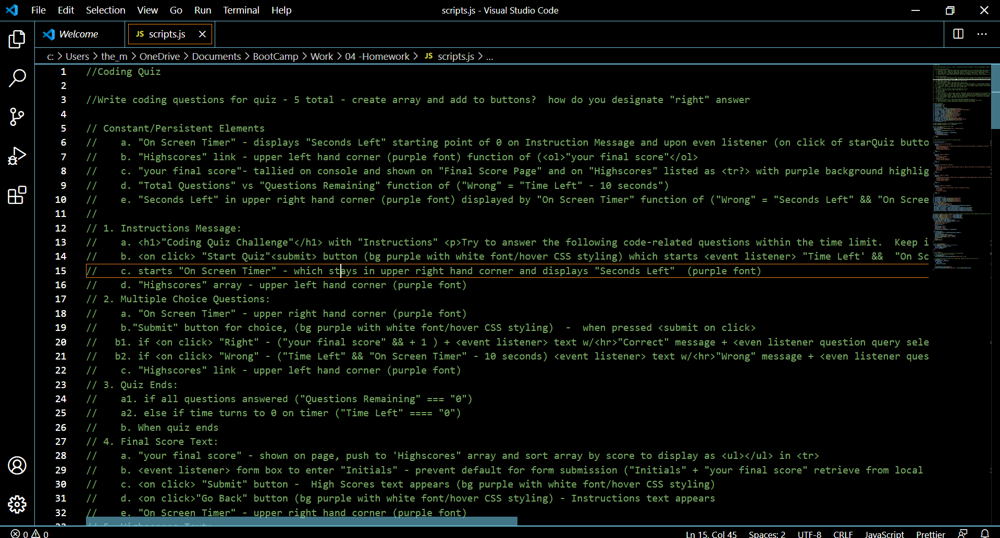

# Coding Quiz - Utilizing Web APIs

## Overview

The client expressed needs for a code quiz to test their coding knowledge against their peers.

## Client's Needs/Expectations

The client, a coding bootcamp student established that the following needs/expecations must be met:

- The quiz must be timed with multiple-choice questions.
- The user interface must be clean and polished so that is responsive.
- The app will run in the browswer, adn will feature dynamically updated HTML and CSS change by JavaScript.

## Updates and Exepctations Obtained from Coding Bootcamp Student Input

Through information and feedback provided by the coding boot campot student, the following update criteria were established:

- The quiz must be timed and cover JavaScript fundamentals to store high scores against their peers.
- Given that the boot camp student is taking a time codequiz :
  - When the studen clicks the start button
    - Then a timer starts and they are presented with a question.
    - When they answer a question:
      - Then they are presented with another question.
      - When they answer a question incorrectly, then 10 seconds is subracted from the clock.
      - When all questions are answered or the time reaches 0
      - Then the game is over
- When the game is over:
- Then the game is over.
- Then they can save their initials and score.

## Overall Deployment of Quiz

- document.querySelectors and add.EventListeners deployed to dynamically bring document elements in and out of the quiz.
- When the boot camp student presses the start quiz button event listeners are triggered for:
  - The timer starts counting down from 75 seconds.
  - The instructions are set to "hide".
  - The first question is shown.
- If the student chooses the correct answer and alert box with "You're right!" pops up. If the wrong answer is shown, an alert box with "You're wrong." is displayed.
  - Questions are generated from an array and the choices are generated on to buttons from the array.
  - Since the user's answers are generated from inputs, parseInt is used to retrieve the answer from the console log.
- When the user either runs out of time or completes the quiz, the submit initals box and end score appears by removing the "hidden' attribute.
  - The student's initals and score and stored on the client-side and must be extracted using JSon Parser to added to the high score array.
- Once the student has submitted their initials by clicking the submit button, they're linked to the High Scores Page.

## Deployed Optimized Website and Final JavaScript Code

\*[Deployed website](https://kay0s.github.io/Web-APIs-Code-Quiz/) \*[GitHub Repository]https://github.com/Kay0s/Web-APIs-Code-Quiz

## Research Resources

- [GeeksforGeeks- Hid or Show Elements in HTML](https://www.geeksforgeeks.org/hide-or-show-elements-in-html-using-display-property/)
- [MDN web docs - EventTarget.addEventListener()](https://developer.mozilla.org/en-US/docs/Web/API/EventTarget/addEventListener)
- [Javascript.Info - Global Object](https://javascript.info/global-object)

© 2020 Kristina Hamilton and Trilogy Education Services, a 2U, Inc. brand. All Rights Reserved.
